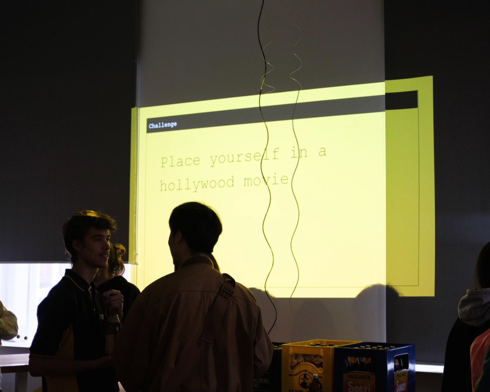
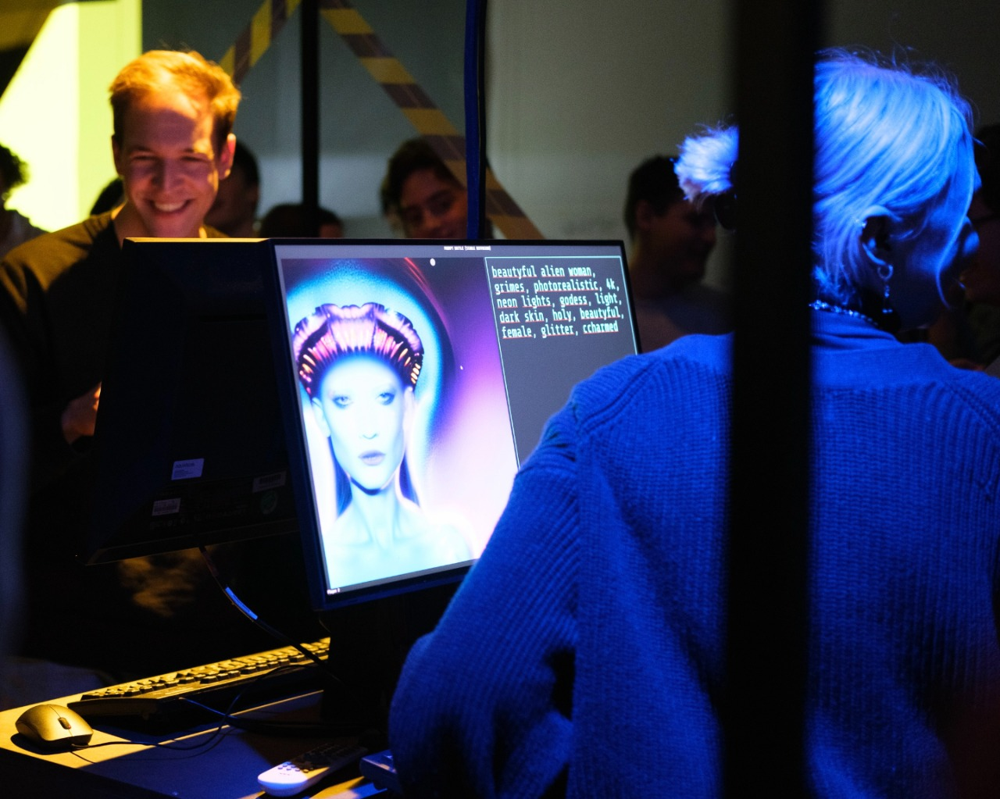
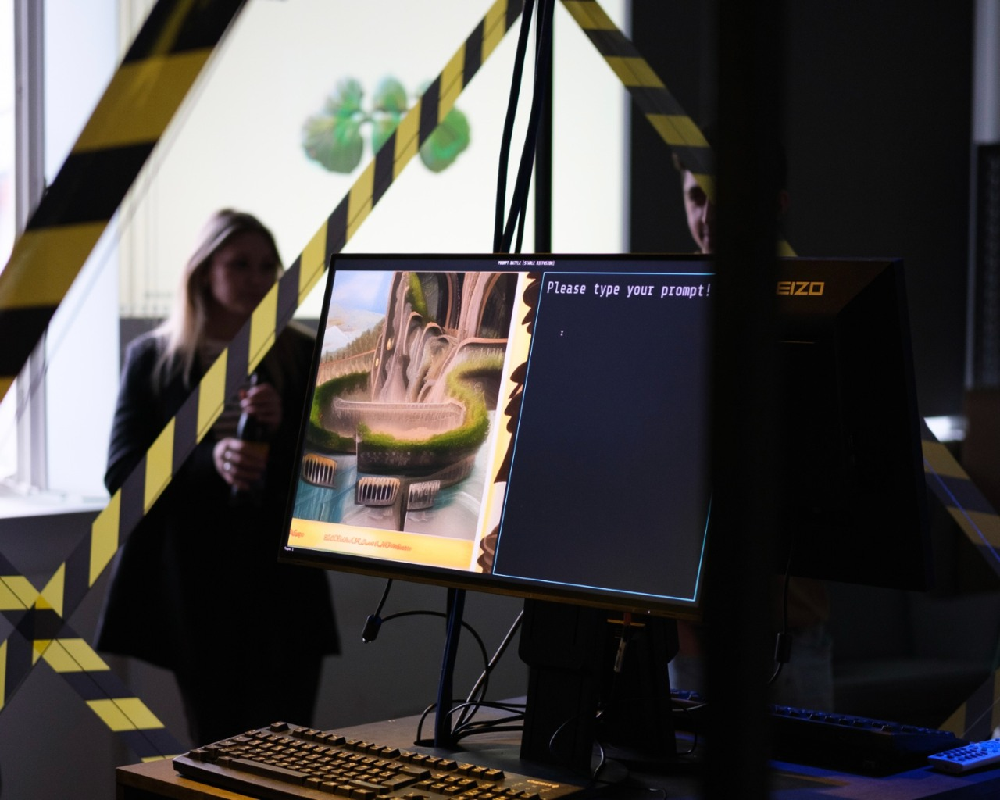
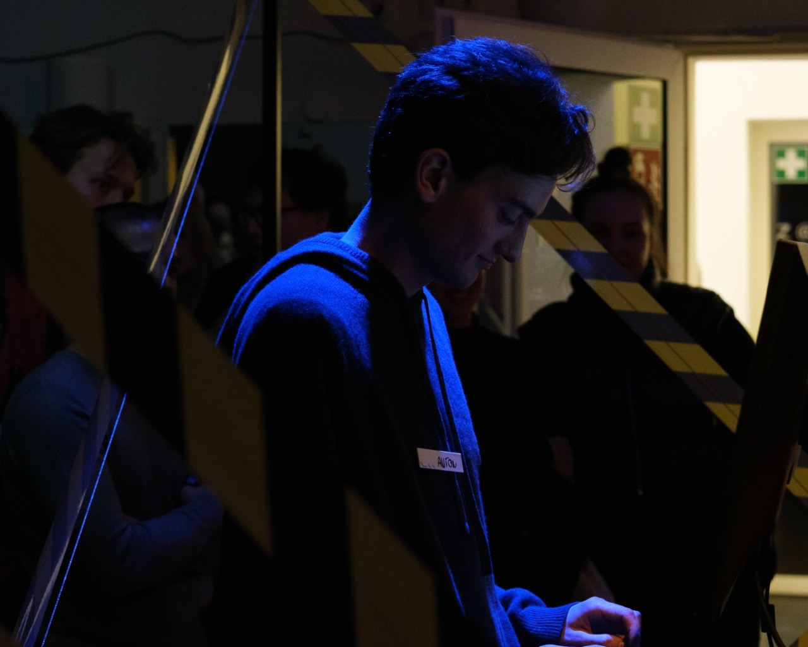

On Wednesday, the AI+Design Lab at the HFG held its grand opening. The evening began with a cozy exchange of ideas, drinks, and snacks, followed by the highly anticipated Prompt Battle. The Prompt Battle was a humorous contest where participants went head to head, using text prompts to generate images through a KI software. The audience then decided which image was the winner. It was a great night of creativity, laughs, and a bit of healthy competition.

The Prompt Battle was a fun and exciting way to showcase the capabilities of KI software and its applications in the field of design. The competition was intense, and the participants were fearless in their approach to the contest. The keyboards were working overtime, and the KI software was put to the test, pushing its parameters to the limit.

It was a great way to engage with the audience, showing them the potential of KI technology and its ability to enhance the design process. The event provided an opportunity for participants to explore the relationship between KI and design, and how these two fields can work together to create innovative and exciting new applications.

The event was a huge success, and the AI+Design Lab is looking forward to working with the participants to develop new applications at the intersection of design and KI. The lab is committed to exploring the potential of KI technology to revolutionize the design process and create new and innovative solutions to some of today's most pressing design challenges.

---

> - This article was written with the support of [ChatGPT](https://chat.openai.com/)
