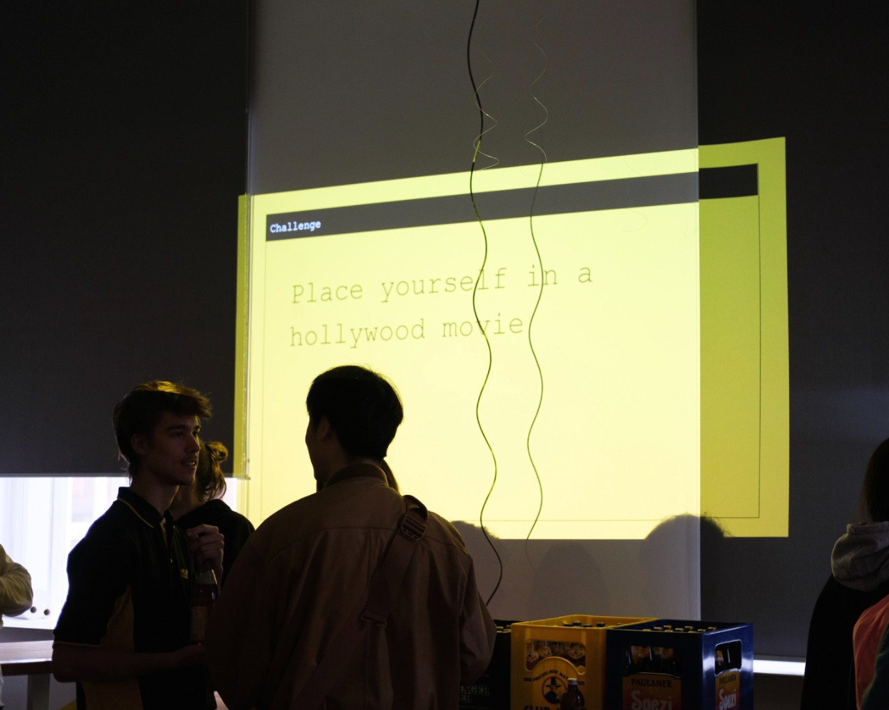
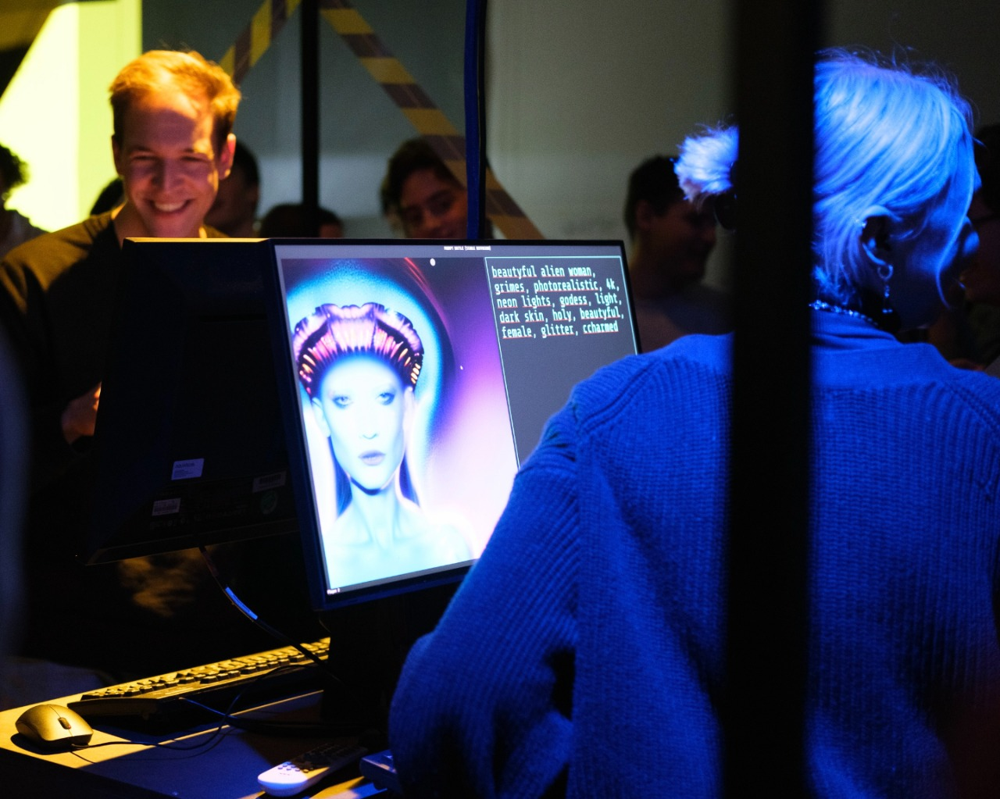
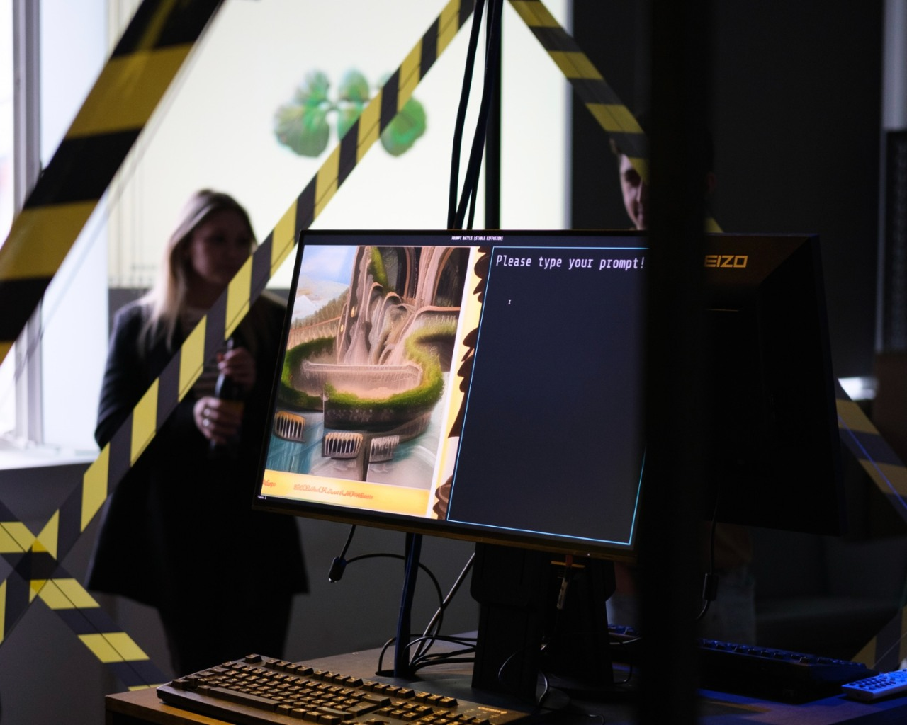
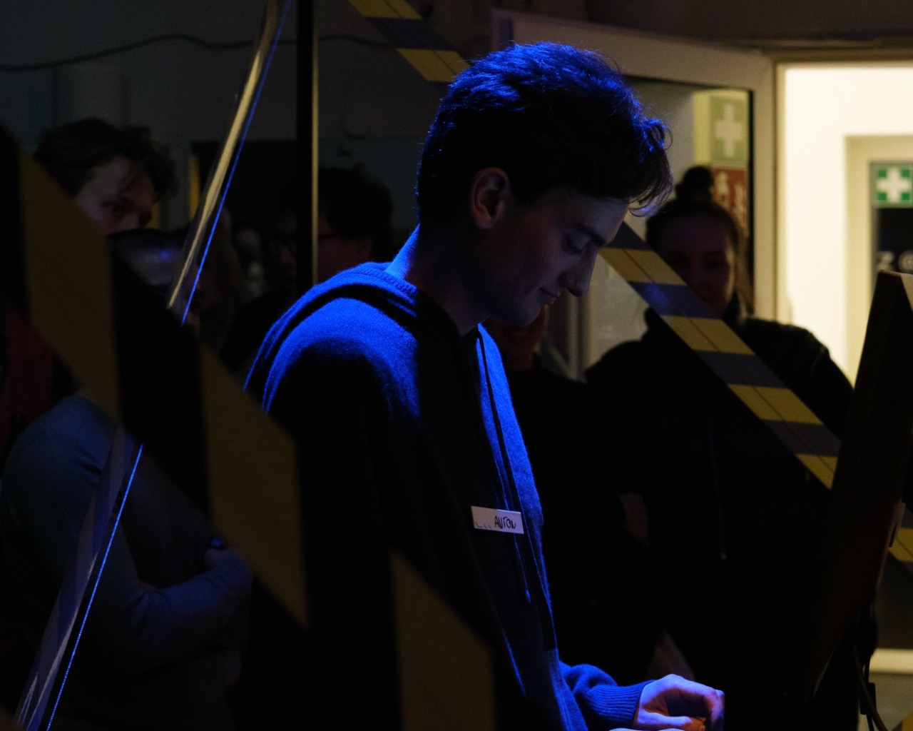

On Wednesday we officially opened the AI+Design Lab at the HFG and invited colleagues and students to come by and connect.
Following a brief introduction to the research project and the project members working with the AI+D Team, we offered pizza and drinks.
The highlight of the evening was the Prompt Battle - an event invented by a Team at the [HTW Dresden](https://htw-dresden.de).
It's inspired by rap battles, but instead of rhymes, participants battled each other by generating images with Stable Diffusion.
The tournament was held in a 1v1 single elimination bracket.

Each match consisted of a best of 5: Up to five challenges where given, according to which the students then took their best shot at prompting Stable Diffusion to produce a witty image.
Each round the audience judged both pictures and decided the better image by gathering behind their contestants of choice.

The Prompt Battle was a fun and exciting way to showcase the capabilities of AI software and its applications. The competition was intense, and the participants were fearless in their approach to the contest. The keyboards were working overtime, and the algorithm was put to the test, pushing its parameters to the limit.

It was a great way to engage with the audience, showing them the potential of AI technology and its ability to enhance the design process. The event provided an opportunity for participants to explore the relationship between AI and design, and how these two fields can work together to create innovative and exciting new applications.

The event was a huge success, and the AI+Design Lab is looking forward to working with the participants to develop new applications at the intersection of design and AI. The lab is committed to exploring the potential of AI technology to revolutionize the design process and create new and innovative solutions to some of today's most pressing design challenges.

---

> - This article was written with the support of [ChatGPT](https://chat.openai.com/)
